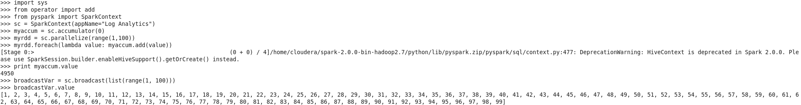

# physpark

# System Commands Return Code
  - Kode tersebut menggunakan library sys.process di Scala untuk menjalankan perintah shell, dengan variabel res yang menampung hasil perintah "ls /tmp", kemudian cetak output dengan nilai variabel res, yang akan berupa 0 jika perintah berhasil dan non-0 jika gagal.
  

# Import Initialize Create an RDD

